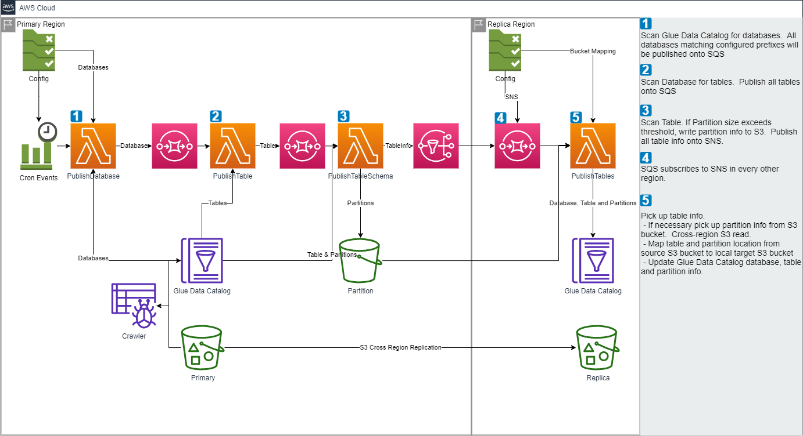
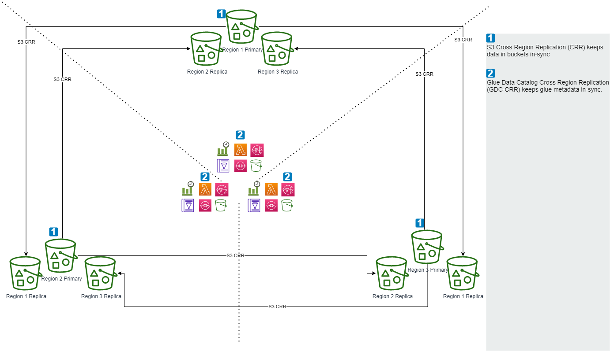

# AWS Glue Data Catalog Cross Region Replication (CRR) Utility
This Utility is used to replicate Glue Data Catalog from one AWS region to another region.
Using this, you can replicate Tables and Partitions from one AWS region to one or more target AWS regions.
It uses AWS Glue APIS / AWS SDK for Java and serverless technologies such as AWS Lambda, SQS and SNS.

This utility complements AWS S3 native Cross-Region Replication (CRR). (https://docs.aws.amazon.com/AmazonS3/latest/userguide/replication.html#crr-scenario)
AWS Glue Data Catalog does not have a native CRR, so while files can be replicated, the Glue Data Catalog metadata
will not be replicated.  One option is to re-run the Glue crawler in the replica region.  This utility offers an
alternative to that option.

This utility is inspired by Ravi Itha's "AWS Glue Data Catalog Replication Utility".
https://github.com/aws-samples/aws-glue-data-catalog-replication-utility. 
Ravi's AWS GDC Replication utility is for cross-account. 
This utility is for same-account, cross-region.

This utility to the pattern "SNS fanout to SQS queues."  Source region provides an SNS topic.
Target regions can SQS-subscribe to source regions' SNS to receive updates.  Target regions can SQS-subscribe
to multiple SNS.

## Support patterns
### Primary, Replica
- One Source region with the source-region deployment.
- One Target region with the target-region deployment.

### Primary, Multiple Replicas
- One Source region with the source-region deployment.
- Many Target regions with the target-region deployment.

### Multiple Primary, Multiple Replicas
Every region has both the Source and Target deployments

  

## Build Instructions
1. The source code is Maven.  You can build it using standard Maven commands e.g. '''mvn -v clean install'''.
2. The above steps generates a target directory with build artifacts, including the Lambda JAR file target/gluecrr-0.0.1.jar

## Deployment Instructions
### Common
A simple Linux interface can be used. During development, I used Windows 10 running Ubuntu 20.04 LTS from Microsoft Store.
Install AWS CLI and you are ready to run deploy.sh in source and target accounts

- Configure AWS credentials ($HOME/.aws) for multiple profiles. For example:
  - profile east1 - us-east-1
  - profile east2 - us-east-2
  - profile west1 - us-west-1
  - profile west2 - us-west-2

### Source Account
1. Enter scripts/source-region/ 
2. Customize the parameters.json
  1. For example, update pDatabasePrefixList for the databases in this region you wish to replicat
3. Deploy - ./deploy.sh -p east1 (to deploy "source" to us-east-1)
4. Note the SNS Topic ARN

### Target Account
1. Enter scripts/target-region/
2. Customize the parameters.json
   1. Update pSnsTopicArn for the Source region's SNS Topic ARN
   2. Update TBD to map the Source region's data bucket to the Target region's data bucket.
        - That way, queries will be using the region's local S3 bucket, not cross-region
3. Deploy - ./deploy.sh -p west2 (to deploy "source" to us-west-2)

## Assumptions
This utility does not setup the S3 Cross Region Replication (S3-CRR).

## AWS Service Requirements
This utility uses the following AWS services
### Source Account
 - 3 AWS Lambda Functions
 - 2 Amazon SQS Queues
 - 1 Amazon SNS Topic
 - 1 Amazon S3 Bucket
 - 1 AWS IAM Role

### Target Account
 - 1 AWS Lambda Function
 - 1 Amazon SQS Queue

## Notes
- Database without tables will not replicate.
- No self clean-up on cloudformation deployment S3 buckets. You may want to consider manual or lifecycle clean-up
- No self clean-up on replication S3 buckets.  You may want to consider manual or lifecycle clean-up.

## Questions
 - For the Lambda publishing Database, why switch the target from an SNS Topic to an SQS queue?
    - Since there is only 1 subscriber listening to Database messages, an SQS queue seemed more appropriate.
    If in the future there is use-case to fanout the Database messages, an SNS topic may be more appropriate.
  - Why is there separate the Lambda publishing tables and table-schema?  Why not keep it as 1 lambda?
    - I am not really sure if there is a case where, due to table size or partitions, publishing a table schema 
    would take a long time.  It seemed more scalable manage scalability as a function of lambda's concurrency.
  - Why is the SNS pushing to an SQS+Lambda?  Why not notify the Lambda directly from the SNS?
    - Please feel free to make that modification. It's a simple update to scripts/target-region/template.yaml.
    The choice to use SNS -> SQS -> Lambda is specific to my local restrictions.
  - Why no Dead-Letter-Queue?
    - I couldn't think of an occasion where, if consumption failed, the CloudWatch log on the Import lambda would not be sufficient.
    But it would probably be better to slim down the debug logs on the Import lambda and handle exceptions in a DLQ and DLQ Lambda.  TBD.

## TBD
- Multi-Primary
  - Update SNS Subscription so SQS can subscribe to multiple SNS, ever SNS except the one in its own region.
    - Would require refactoring SNS Subscription.  Cloudformation does not support a foreach looping,
      and AWS::SNS::Subscription Region and TopicArn expect String not List<String>.  So for SQS to subscribe to multiple
      SNS, we would need to remove the AWS::SNS:Subscription from CloudFormation and handle the subscription as a script.
      It would need to parse lists of ARNTopics and use "aws sns subscribe --topic-arn --protocol sqs --notification-endpoint <ARN-of-SQS>" on each. 
- Refactor
  - Move configuration to DynamoDB or Parameter Store
    - On-hold or now.
    - DyanmoDB would incur storage and read/write costs. Could be worthwhile as part of a bigger architecture,
    but standalone does not seem superior to lambda environment variables.
    - Parameter Store, if using standard and normal through-put, would be free.  But it would be slower than lambda environment
    variables.  Could be worthwhile as part of a bigger architecture.
  - DynamoDB for audit trails
    - On-hold.  CloudWatch already has all the data. Could be worthwhile as part of a bigger architecture,
    assuming that architecture is based upon DynamoDB and not CloudWatch for log consolidation.
  - DLQ on Target accounts
    - On-hold.  Uncertain what messages would get dropped, if it did why we wouldn't already track it through CloudWatch.
  - Code clean-up
    - On-going.
  - Cloudwatch events for cron-style scheduling
    - On-hold.  Trivial to integrate. For PoC, ad-hod start through Lambda console "Test" button more useful.

